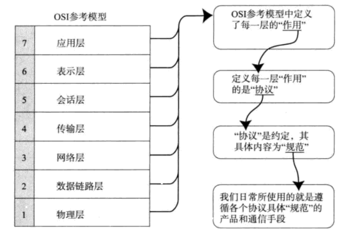
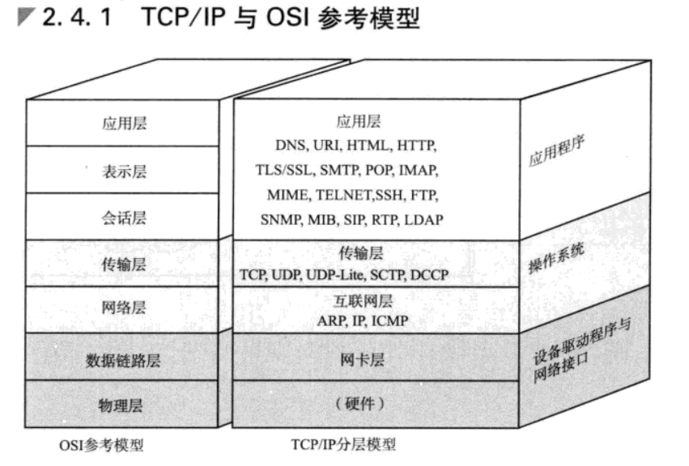
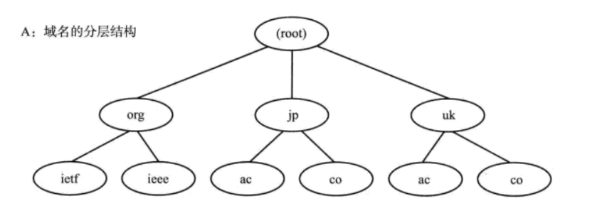
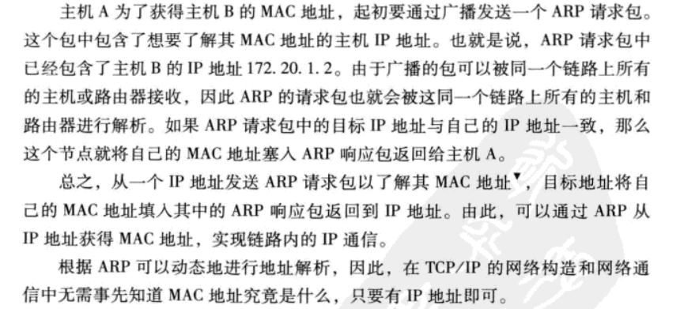
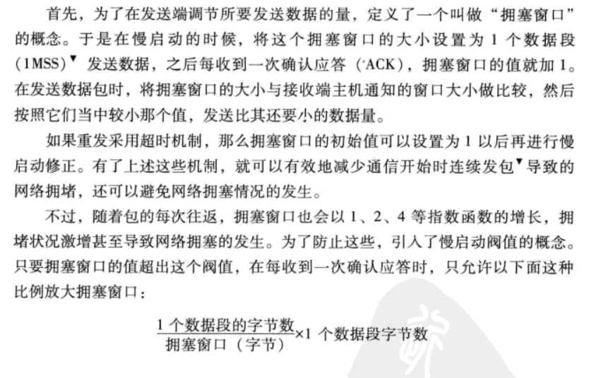

# TCP

## OSI参考模型

## TCP/IP模型

### 应用层
### 传输层
### 网际层
### 网络接口层
## IP协议
>相当于OSI中的网络层，主要作用是实现终端节点之间的通信。
### 路由控制
### 路由算法
### 路由控制表
>所有主机都维护一张路由控制表。该表记录IP数据在下一跳应该发送给哪个路由器。
### IP地址
>由网络和主机两部分标识组成
#### 分类
**ipv4**
- A类地址

- B类地址

- C类地址

- D类地址

**ipv6**

### DNS
#### DNS系统的作用
>它可以维护一个用来表示组织内部主机名（域名）和IP地址之间对应关系的数据库
#### 域名的分层结构

#### 解析器
>进行DNS查询的主机和软件叫做DNS解析器
#### DNS查询
>比如我现在需要访问贵公司的域名，那么首先会调用本机的域名解析器，域名解析器为了查询IP地址，会向域名服务器进行查询。

#### ARP的工作机制

### ICMP

## TCP与UDP
### 传输层的作用
>让本机的端口与服务器的指定端口建立链接和断开链接。
### TCP
>TCP是面向链接的、可靠的流协议。
- 特点
1. 通过检验和、序列号、确认应答、重发控制、链接管理以及窗口控制等实现可靠性传输。
#### 序列号和确认应答号
#### 重发超时如何确定
#### 利用窗口控制提高速度
>确认应答不再是以每个分段，而是以更大的单位来进行确认。
##### 窗口
>无需等待确认应答而可以继续发送数据的最大值。同时添加缓冲区保留窗口中的数据。
##### 高速重发控制
#### 流控制
>TCP提供一种机制可以让发送端根据接收端的实际接受能力控制发送的数据量。具体实现就是接收端向发送端主机通知自己可以接受数据的大小。
#### 拥塞控制
>通信开始通过一个慢启动的算法得出的数值，对发送的数据进行控制。

##### 慢启动阈值
>设置为超时重发时窗口大小的一半。

### UDP
>UDP是不具有可靠性的数据报协议。
#### UDP的特点和目的
- 特点
1. 面向无连接
2. 可以随时发送数据
3. UDP本身处理简单高效

- 使用场景
1. 包总量较少的通信DNS、SNMP
2. 视频、音频等多媒体通信
3. 广播通信

### TCP与UDP的使用场景区别

### 端口号与协议

### 提高网络利用率规范
#### Nagle算法
#### 延迟确认应答

## 路由控制
### 路由算法
#### 距离向量算法
#### 链路状态

## 应用层协议
### 远程登录
#### RELNET
#### SSH
### 文件传输
### 电子邮件
