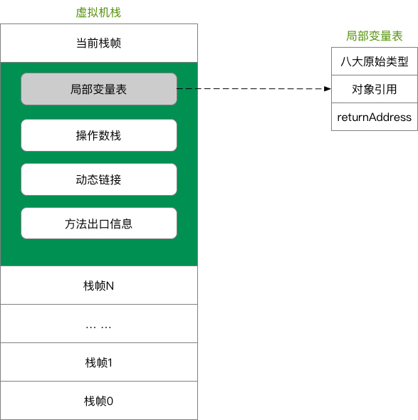

# JVM
>从软件层面屏蔽不同操作系统在底层硬件与指令上的区别
- JDK
- JRE
- JVM

# 程序运行过程

# Java虚拟机的组成
- 字节码执行引擎
- 类装载子系统
- 运行时数据区（内存模型）

# Java内存区的组成
## 栈
>Java 虚拟机栈是描述 Java 方法运行过程的内存模型。

### 解释
Java 虚拟机栈会为每一个即将运行的 Java 方法创建一块叫做“栈帧”的区域，用于存放该方法运行过程中的一些信息，如：
* 局部变量表：存放局部变量的值或地址
* 操作数栈：一个以字长为单位的数组，用来是一种保存操作数的数据结构。进行操作时先将2个操作数压入栈中，运到操作符时，弹出栈顶的2个数然后计算结果并压入。
* 动态链接
* 方法出口信息：调用这个方法的位置的地址值
* ......

### 压栈出栈过程

当方法运行过程中需要创建局部变量时，就将局部变量的值存入栈帧中的局部变量表中。

Java 虚拟机栈的栈顶的栈帧是当前正在执行的活动栈，也就是当前正在执行的方法，PC 寄存器也会指向这个地址。只有这个活动的栈帧的本地变量可以被操作数栈使用，当在这个栈帧中调用另一个方法，与之对应的栈帧又会被创建，新创建的栈帧压入栈顶，变为当前的活动栈帧。

方法结束后，当前栈帧被移出，栈帧的返回值变成新的活动栈帧中操作数栈的一个操作数。如果没有返回值，那么新的活动栈帧中操作数栈的操作数没有变化。

> 由于Java 虚拟机栈是与线程对应的，数据不是线程共享的，因此不用关心数据一致性问题，也不会存在同步锁的问题。

### Java 虚拟机栈的特点

* 局部变量表随着栈帧的创建而创建，它的大小在编译时确定，创建时只需分配事先规定的大小即可。在方法运行过程中，局部变量表的大小不会发生改变。
* Java 虚拟机栈会出现两种异常：StackOverFlowError 和 OutOfMemoryError。
  * StackOverFlowError  若 Java 虚拟机栈的大小不允许动态扩展，那么当线程请求栈的深度(栈帧的数量)超过当前 Java 虚拟机栈的最大深度时，抛出 StackOverFlowError 异常。
  * OutOfMemoryError  若允许动态扩展，那么当线程请求栈时内存用完了，无法再动态扩展时，抛出 OutOfMemoryError 异常。
* Java 虚拟机栈也是线程私有，随着线程创建而创建，随着线程的结束而销毁。

> 出现 StackOverFlowError 时，内存空间可能还有很多。

## 本地方法栈（C 栈）

### 本地方法栈的定义

本地方法栈是为 JVM 运行 Native 方法准备的空间，由于很多 Native 方法都是用 C 语言实现的，所以它通常又叫 C 栈。它与 Java 虚拟机栈实现的功能类似，只不过本地方法栈是描述本地方法运行过程的内存模型。
>常见的本地方法，和作用。
### 栈帧变化过程

本地方法被执行时，在本地方法栈也会创建一块栈帧，用于存放该方法的局部变量表、操作数栈、动态链接、方法出口信息等。

方法执行结束后，相应的栈帧也会出栈，并释放内存空间。也会抛出 StackOverFlowError 和 OutOfMemoryError 异常。

> 如果 Java 虚拟机本身不支持 Native 方法，或是本身不依赖于传统栈，那么可以不提供本地方法栈。如果支持本地方法栈，那么这个栈一般会在线程创建的时候按线程分配。

## 程序计数器
### 定义
当前线程所执行字节码的行号指示器。

### 作用
- **字节码解释器**通过改变程序计数器来依次读取指令，从而实现代码的流程控制。
- 在多线程情况下，程序计数器记录的是当前线程执行的位置，从而当线程切换回来时，就知道上次线程执行到哪了。

### 特点
- 是一块较小的内存空间。
- 线程私有，每条线程都有自己的程序计数器。
- 生命周期：随着线程的创建而创建，随着线程的结束而销毁。
- 是唯一一个不会出现`OutOfMemoryError`的内存区域。

## 堆
>Java堆是被所有线程所共享的一块内存区域，目的是为了存放对象实例。
### 特点
- 线程共享
- 垃圾回收的主要场所
- 不同区域存放不同生命周期的对象，这样可以根据不同的区域使用不同的垃圾回收算法。
>Java堆使用的内存区域可以不连续。`区分逻辑内存和物理内存`。

## 方法区
>用于存储已被虚拟机加载的类信息、常量、静态变量、即时编译器编译后的代码等数据。
### 运行时常量池
>用于存放编译期生成的各种字面量和符号引用。常量放运行时常量池，方法区中放：类信息，常量，静态变量，即时编译器编译后的代码。
### 直接内存(堆外内存)
>直接内存是除Java之外的内存，但也可能被Java使用。
#### 操作直接内存
在NIO中引入了一种基于通道和缓冲的IO方式。它可以通过调用本地方法直接分配Java虚拟机之外的内存，然后通过一个存储在堆中的`DirectByteBuffer`对象直接操作该内存，而无需先将外部内存中的数据复制到堆中再进行操作，从而提高数据操作的效率。
#### 直接内存与堆内存比较
- 直接内存申请空间耗费更高的性能
- 直接内存读取IO的性能优于普通内存。
- 直接内存作用链：本地IO -》直接内存 -》本地IO
- 堆内存作用链：本地IO -》直接内存 -》非直接内存 -》直接内存 -》本地IO
